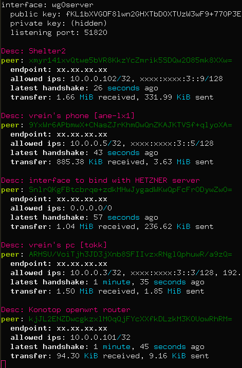

# WGnames
## Wireguard human readable peer names / description
 

### Description
A little awk wrapper for adding description to wg peer list

### Configuration
My peer list looks like this
```
[Peer]
#Description = vrein's pc [tokk]
PublicKey = ARHSU/VoiTjh3JD3jXnb8SFIIvzxRNglQphuwR/a9zQ=
AllowedIPs = 10.0.0.3/32, xxxx:xxxx:3::3/128, 192.168.122.0/24


[Peer]
#Description = vrein's laptop [hopper]
PublicKey = KOx72CQCbjcWCpWm0Etq8erI+my81eR+RqyayqhZkSo=
AllowedIPs = 10.0.0.4/32, xxxx:xxxx:3::4/128


[Peer]
#Description = vrein's phone [ane-lx1]
PublicKey = 9YxWr6APbmwX+CNasZJrKhmOwQnZKAJKTVSf+qlyoXA=
AllowedIPs = 10.0.0.5/32, xxxx:xxxx:3::5/128


[Peer]
#Description = vrein's phone [oukitel]
PublicKey = /S9uj08YKXYbDkkKB8xy/ABy1CIMVQdq7B4rAZdL3RU=
AllowedIPs = 10.0.0.6/32, xxxx:xxxx:3::6/128
```

